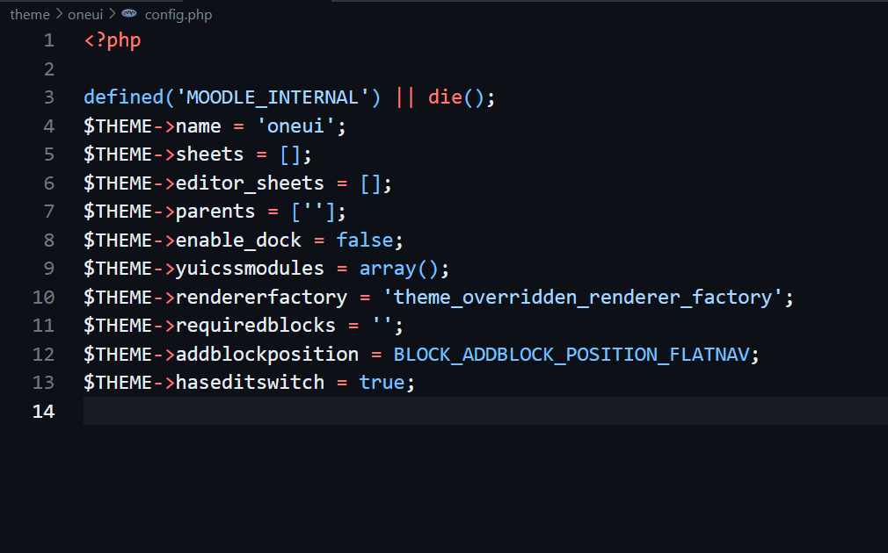
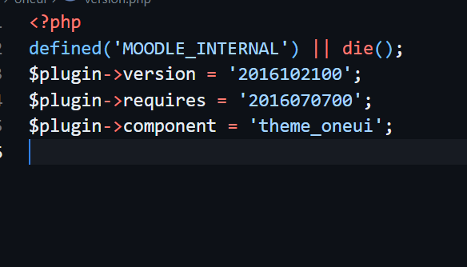
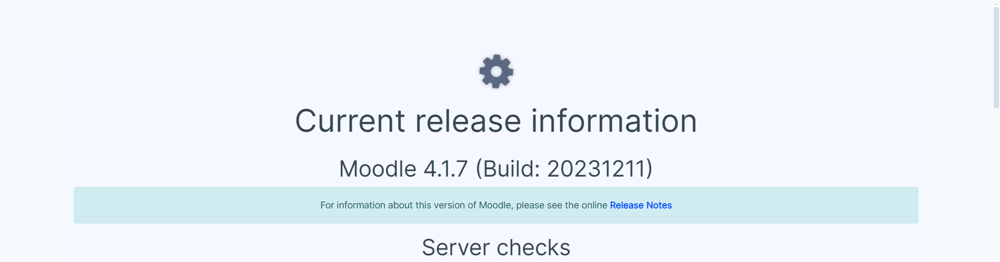
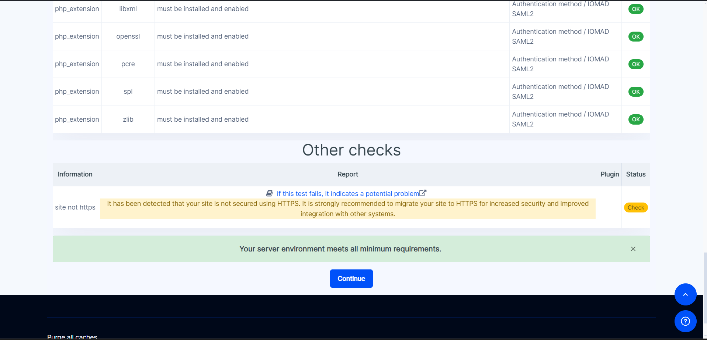
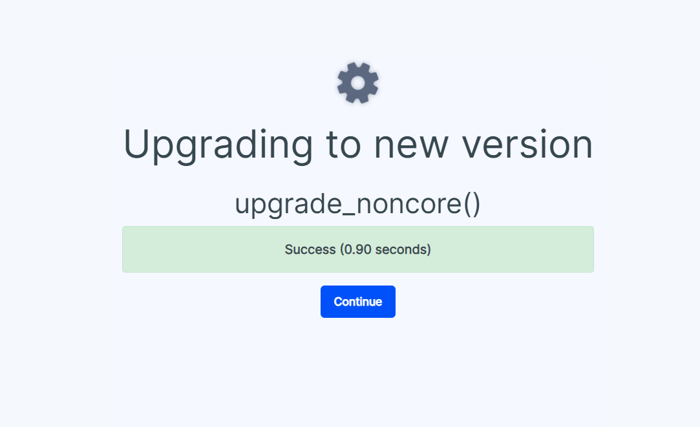

# Setting Up OneUI Theme for Moodle

Follow these steps to integrate the OneUI theme into your Moodle setup:

1. **Clone this repo in theme folder of moodle**:

   - Navigate to `theme` directory in your moodle installation.
   - Run the following command:
   ```
   git clone https://github.com/SRRInternational/moodle-parent-theme.git oneui
   ```

2. **Configure Theme**:

   - Inside `theme/oneui`, create a `config.php` file.
   - Modify `config.php` to set the theme name and any other configurations needed.
     

3. **Versioning**:

   - Create a `Version.php` file in `theme/oneui` to manage versioning.
     

4. **Add Images**:

   - Within `theme/oneui`, create a `pix` folder.
   - Add necessary images required for the theme to function properly.

5. **Language Setup**:
   - Create an `en` folder inside `theme/oneui/lang/`.
   - Inside `en`, create `theme_oneui.php`.
   - Add the theme name and any other language-specific strings needed for the theme.

### Example `theme_oneui.php`:

**Output on Moodle site**

 *got redireacted to upgrade page to perform upgrade*
  - This are the Screenshots of Upgrade




